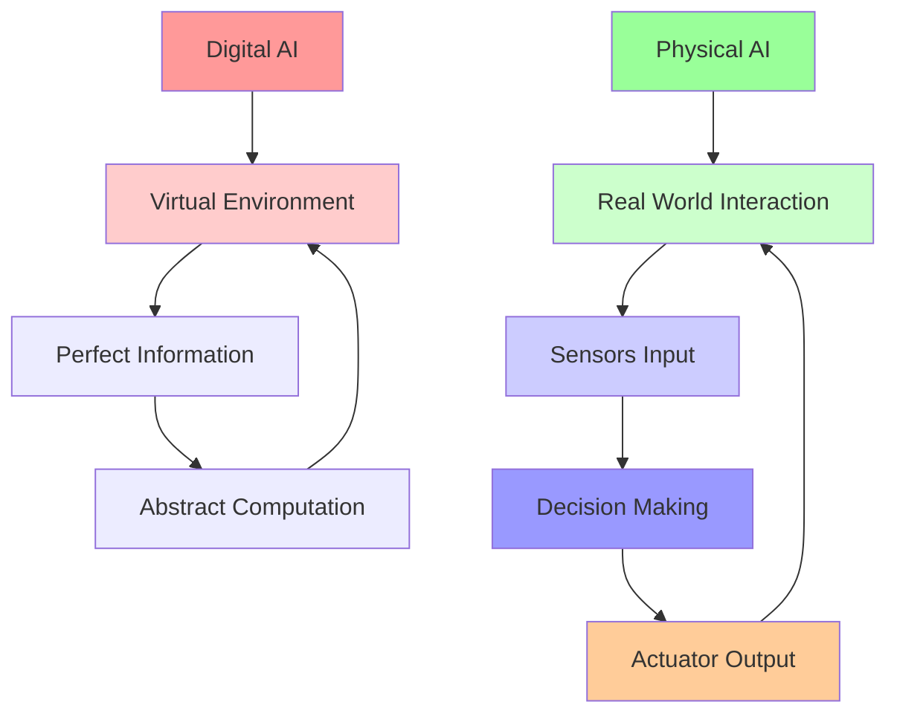
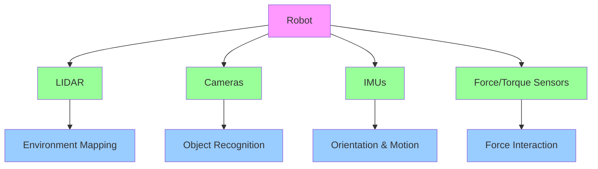

# Introduction to Physical AI

## Foundations of Physical AI and Embodied Intelligence

### What is Physical AI?

Physical AI represents a paradigm shift from traditional digital AI systems to intelligent agents that interact with the physical world. Unlike digital AI, which operates in virtual environments with perfect information, Physical AI must navigate the complexities, uncertainties, and constraints of the real world.

### Embodied Intelligence

Embodied intelligence is a fundamental concept in Physical AI that emphasizes the role of the body in shaping cognition. Rather than treating intelligence as abstract computation, embodied intelligence recognizes that:

1. **Cognition emerges from interaction**: Intelligence develops through the continuous interaction between an agent and its environment
2. **Morphology matters**: The physical form of an agent influences its cognitive capabilities
3. **Sensing and acting are coupled**: Perception and action are not separate processes but interconnected aspects of intelligent behavior

## From Digital AI to Physical Robots

The transition from digital AI to physical robots represents a significant shift in both theoretical understanding and practical implementation. While digital AI systems operate in controlled, deterministic environments, physical robots must navigate the complexities of the real world.

### Key Differences

| Digital AI | Physical AI |
|------------|-------------|
| Perfect information available | Noisy, incomplete sensor data |
| Instantaneous responses | Subject to physical constraints |
| Deterministic environments | Stochastic, unpredictable environments |
| Unlimited computational resources | Limited by power, heat, hardware |
| No wear and tear | Mechanical degradation over time |

### AI-to-Robot Flow Diagram

The above diagram illustrates the fundamental difference between digital AI operating in virtual environments with perfect information and physical AI that operates through continuous sensing and acting in the real world.

## Humanoid Robotics Landscape

Humanoid robots represent a fascinating intersection of engineering, cognitive science, and human factors. These robots are designed with human-like form and capabilities, enabling more intuitive interaction with human environments.

### Current State of Humanoid Robotics

The humanoid robotics field has seen significant advances in recent years, with several platforms demonstrating impressive capabilities:

#### Major Humanoid Platforms

**Honda ASIMO (2000-2018)**
- Pioneered bipedal walking and human interaction
- Demonstrated complex locomotion and basic manipulation
- Retired in 2018 after 18 years of development

**Boston Dynamics Atlas**
- Advanced dynamic locomotion and balance
- Capable of complex movements like backflips and parkour
- Focus on mobility and dynamic behavior

**SoftBank Pepper**
- Designed for human interaction and service applications
- Emphasizes emotional intelligence and communication
- Commercial deployment in various service industries

### Applications and Use Cases

Humanoid robots are being developed for various applications:

1. **Service Industry**: Customer service, hospitality, and retail
2. **Healthcare**: Patient assistance, therapy, and companionship
3. **Education**: Teaching aids and research platforms
4. **Disaster Response**: Operations in human-inaccessible environments
5. **Domestic Assistance**: Household tasks and eldercare
6. **Research**: Understanding human cognition and social interaction

## Sensor Systems in Physical AI

Robots rely on various sensor systems to perceive and interact with their environment. These sensors provide the information necessary for navigation, manipulation, and decision-making in physical spaces.

### Sensor Systems Overview Diagram

### LIDAR (Light Detection and Ranging)

LIDAR sensors emit laser pulses and measure the time it takes for the light to return after reflecting off objects. This technology provides accurate distance measurements and creates detailed 3D maps of the environment.

**Applications:**
- Environment mapping and localization
- Obstacle detection and avoidance
- Navigation in unknown environments
- 3D reconstruction of objects and spaces

**Advantages:**
- High accuracy in distance measurements
- Works in various lighting conditions
- Provides rich spatial information

**Limitations:**
- Expensive compared to other sensors
- Limited resolution for fine details
- Can be affected by reflective surfaces

### Cameras (Vision Systems)

Cameras provide rich visual information that enables robots to recognize objects, interpret scenes, and understand human gestures and expressions. Modern computer vision algorithms allow robots to extract meaningful information from visual data.

**Types of Vision Systems:**
- **RGB Cameras**: Standard color imaging
- **Stereo Cameras**: Depth estimation through triangulation
- **RGB-D Cameras**: Color plus depth information
- **Thermal Cameras**: Heat signature detection

**Applications:**
- Object recognition and classification
- Scene understanding and interpretation
- Human-robot interaction
- Visual servoing for manipulation tasks

**Advantages:**
- Rich information content
- Relatively low cost
- Human-like perception modality

**Limitations:**
- Performance affected by lighting conditions
- Computationally intensive processing
- Limited depth information in standard cameras

### Inertial Measurement Units (IMUs)

IMUs combine accelerometers, gyroscopes, and sometimes magnetometers to measure the robot's orientation, acceleration, and angular velocity. These sensors are crucial for balance control and motion tracking.

**Components:**
- **Accelerometers**: Measure linear acceleration
- **Gyroscopes**: Measure angular velocity
- **Magnetometers**: Measure magnetic field direction (for heading)

**Applications:**
- Balance and posture control
- Motion tracking and navigation
- Vibration detection and analysis
- Fall detection and recovery

**Advantages:**
- High-frequency measurements
- Compact and lightweight
- Essential for dynamic systems

**Limitations:**
- Drift over time (especially for position estimation)
- Sensitive to calibration and temperature
- Integration errors accumulate

### Force/Torque Sensors

Force and torque sensors measure the forces and moments applied to the robot's body or end-effectors. These sensors are critical for safe and precise physical interaction with objects and humans.

**Types:**
- **6-axis force/torque sensors**: Measure forces in 3 directions and torques around 3 axes
- **Tactile sensors**: Distributed force sensing across surfaces
- **Joint torque sensors**: Measure forces at individual joints

**Applications:**
- Safe human-robot interaction
- Precise manipulation tasks
- Assembly and manufacturing operations
- Haptic feedback and teleoperation

**Advantages:**
- Enable compliant and safe interaction
- Provide feedback for precise control
- Essential for dexterous manipulation

**Limitations:**
- Can be expensive
- Require precise calibration
- May limit mechanical design options

## Summary

This chapter has introduced the fundamental concepts of Physical AI, from its theoretical foundations to practical implementations in humanoid robotics. We've explored the transition from digital AI to physical robots and examined the essential sensor systems that enable robots to perceive and interact with the physical world.

Understanding these concepts provides the foundation for more advanced topics in Physical AI, including locomotion control, manipulation, planning, and learning in physical environments. The next chapters will build upon these foundations to explore specific techniques and applications in Physical AI and humanoid robotics.

## References and Further Reading

- [Physical Intelligence (PI) Research](https://panaversity.org)
- [ROS Documentation](https://docs.ros.org/en/humble/)
- [IEEE Robotics and Automation Society](https://www.ieee-ras.org/)
- [International Conference on Robotics and Automation (ICRA)](https://www.icra-conf.org/)
- [Boston Dynamics Atlas Robot](https://www.bostondynamics.com/atlas)
- [Honda ASIMO History](https://www.honda.co.jp/ASIMO/technology/)
- [SoftBank Pepper Robot](https://www.softbankrobotics.com/emea/en/pepper)
- [LIDAR Technology Overview](https://en.wikipedia.org/wiki/Lidar)
- [Computer Vision in Robotics](https://www.cvrobotics.org/)
- [Inertial Measurement Units Explained](https://www.analog.com/en/analog-dialogue/articles/imus-explained.html)