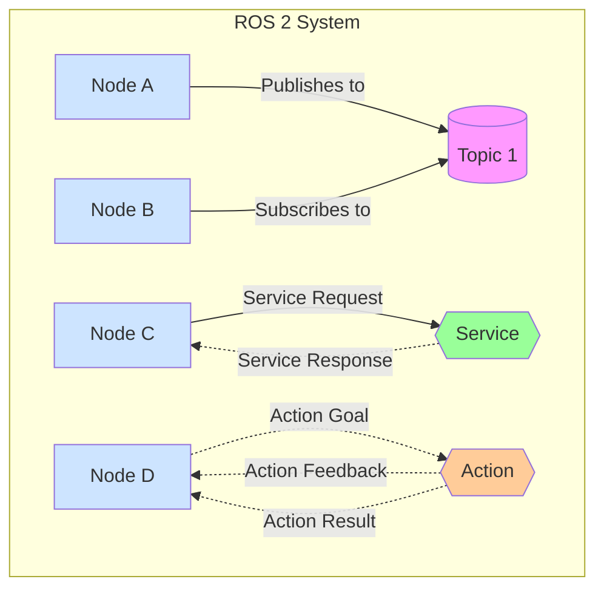

# The Robotic Nervous System (ROS 2)

This chapter introduces the Robot Operating System 2 (ROS 2), the middleware framework that serves as the nervous system for robotic applications. We'll explore the architecture, communication patterns, and tools needed to build sophisticated robotic systems.

## Table of Contents
- [ROS 2 Architecture](#ros-2-architecture)
- [Nodes, Topics, Services, and Actions](#nodes-topics-services-and-actions)
- [Building Python Packages with rclpy](#building-python-packages-with-rclpy)
- [Launch Files](#launch-files)
- [URDF for Humanoid Robots](#urdf-for-humanoid-robots)
- [Summary](#summary)

## ROS 2 Architecture

The Robot Operating System 2 (ROS 2) is a flexible framework for writing robot software. It's a collection of tools, libraries, and conventions that aim to simplify the task of creating complex and robust robot behavior across a wide variety of robot platforms.

### Core Architecture Components

ROS 2 is built on a distributed architecture where computation is performed in nodes. These nodes are organized into packages and can communicate with each other through various mechanisms including topics, services, and actions.

The core components of ROS 2 architecture include:

- **Nodes**: The fundamental unit of execution in ROS 2
- **Communication mechanisms**: Topics, services, and actions for inter-node communication
- **Parameter server**: For configuration management
- **Launch system**: For starting multiple nodes together
- **Tools**: For introspection, debugging, and visualization

### DDS (Data Distribution Service)

ROS 2 uses DDS (Data Distribution Service) as its underlying communication middleware. DDS provides a standardized publish/subscribe communication model that ensures real-time performance, reliability, and scalability.



The above diagram illustrates the different communication patterns in ROS 2: topics for publish/subscribe, services for request/response, and actions for goal-oriented communication with feedback.

## Nodes, Topics, Services, and Actions

### Nodes

A node is a single executable that uses ROS 2 to communicate with other nodes. Nodes are organized into packages to form a ROS 2 system. Each node can perform specific tasks and communicate with other nodes to achieve complex behaviors.

Here's a basic example of a ROS 2 node in Python:

```python
import rclpy
from rclpy.node import Node

class MinimalNode(Node):

    def __init__(self):
        super().__init__('minimal_node')
        self.get_logger().info('Hello ROS 2 World!')

def main(args=None):
    rclpy.init(args=args)
    minimal_node = MinimalNode()

    # Keep the node running until interrupted
    try:
        rclpy.spin(minimal_node)
    except KeyboardInterrupt:
        pass
    finally:
        minimal_node.destroy_node()
        rclpy.shutdown()

if __name__ == '__main__':
    main()
```

### Topics

Topics provide asynchronous, many-to-many communication between nodes using a publish/subscribe pattern. Publishers send messages to a topic, and subscribers receive messages from the topic. Multiple nodes can publish and subscribe to the same topic.

Key characteristics of topics:
- Asynchronous communication
- Many-to-many relationship
- Unidirectional data flow
- Message types must be defined using ROS message definitions

Example of publishing to a topic:

```python
import rclpy
from rclpy.node import Node
from std_msgs.msg import String

class MinimalPublisher(Node):

    def __init__(self):
        super().__init__('minimal_publisher')
        self.publisher_ = self.create_publisher(String, 'topic', 10)
        timer_period = 0.5  # seconds
        self.timer = self.create_timer(timer_period, self.timer_callback)
        self.i = 0

    def timer_callback(self):
        msg = String()
        msg.data = 'Hello World: %d' % self.i
        self.publisher_.publish(msg)
        self.get_logger().info('Publishing: "%s"' % msg.data)
        self.i += 1

def main(args=None):
    rclpy.init(args=args)
    minimal_publisher = MinimalPublisher()

    try:
        rclpy.spin(minimal_publisher)
    except KeyboardInterrupt:
        pass
    finally:
        minimal_publisher.destroy_node()
        rclpy.shutdown()

if __name__ == '__main__':
    main()
```

### Services

Services provide synchronous, request/response communication between nodes. A client sends a request to a service server, which processes the request and returns a response.

Key characteristics of services:
- Synchronous communication
- One-to-one relationship
- Request/response pattern
- Useful for operations that require a specific response

Example of a service server:

```python
import rclpy
from rclpy.node import Node
from example_interfaces.srv import AddTwoInts

class MinimalService(Node):

    def __init__(self):
        super().__init__('minimal_service')
        self.srv = self.create_service(AddTwoInts, 'add_two_ints', self.add_two_ints_callback)

    def add_two_ints_callback(self, request, response):
        response.sum = request.a + request.b
        self.get_logger().info('Incoming request\na: %d b: %d' % (request.a, request.b))
        return response

def main(args=None):
    rclpy.init(args=args)
    minimal_service = MinimalService()

    try:
        rclpy.spin(minimal_service)
    except KeyboardInterrupt:
        pass
    finally:
        minimal_service.destroy_node()
        rclpy.shutdown()

if __name__ == '__main__':
    main()
```

### Actions

Actions provide asynchronous, goal-oriented communication for long-running tasks. They include feedback during execution and result upon completion.

Key characteristics of actions:
- Asynchronous communication
- Goal/feedback/result pattern
- Cancellable operations
- Useful for tasks like navigation or manipulation

## Building Python Packages with rclpy

### Setting up a Python Package

To create a ROS 2 Python package, you need to create a package structure with the following components:

1. `package.xml`: Package manifest
2. `setup.py`: Python setup script
3. `setup.cfg`: Installation configuration
4. `my_package/`: Source code directory

### Creating the package.xml

```xml
<?xml version="1.0"?>
<?xml-model href="http://download.ros.org/schema/package_format3.xsd" schematypens="http://www.w3.org/2001/XMLSchema"?>
<package format="3">
  <name>my_robot_package</name>
  <version>0.0.0</version>
  <description>Example ROS 2 package with Python nodes</description>
  <maintainer email="user@example.com">User Name</maintainer>
  <license>Apache License 2.0</license>

  <depend>rclpy</depend>
  <depend>std_msgs</depend>
  <depend>example_interfaces</depend>

  <test_depend>ament_copyright</test_depend>
  <test_depend>ament_flake8</test_depend>
  <test_depend>ament_pep257</test_depend>
  <test_depend>python3-pytest</test_depend>

  <export>
    <build_type>ament_python</build_type>
  </export>
</package>
```

### Creating the setup.py

```python
from setuptools import setup
from glob import glob
import os

package_name = 'my_robot_package'

setup(
    name=package_name,
    version='0.0.0',
    packages=[package_name],
    data_files=[
        ('share/ament_index/resource_index/packages',
            ['resource/' + package_name]),
        ('share/' + package_name, ['package.xml']),
        (os.path.join('share', package_name, 'launch'), glob('launch/*.py')),
    ],
    install_requires=['setuptools'],
    zip_safe=True,
    maintainer='User Name',
    maintainer_email='user@example.com',
    description='Example ROS 2 package with Python nodes',
    license='Apache License 2.0',
    tests_require=['pytest'],
    entry_points={
        'console_scripts': [
            'talker = my_robot_package.publisher_member_function:main',
            'listener = my_robot_package.subscriber_member_function:main',
        ],
    },
)
```

### Creating a Publisher Node

```python
# File: my_robot_package/publisher_member_function.py
import rclpy
from rclpy.node import Node
from std_msgs.msg import String

class MinimalPublisher(Node):

    def __init__(self):
        super().__init__('minimal_publisher')
        self.publisher_ = self.create_publisher(String, 'topic', 10)
        timer_period = 0.5  # seconds
        self.timer = self.create_timer(timer_period, self.timer_callback)
        self.i = 0

    def timer_callback(self):
        msg = String()
        msg.data = 'Hello World: %d' % self.i
        self.publisher_.publish(msg)
        self.get_logger().info('Publishing: "%s"' % msg.data)
        self.i += 1

def main(args=None):
    rclpy.init(args=args)
    minimal_publisher = MinimalPublisher()

    try:
        rclpy.spin(minimal_publisher)
    except KeyboardInterrupt:
        pass
    finally:
        minimal_publisher.destroy_node()
        rclpy.shutdown()

if __name__ == '__main__':
    main()
```

### Creating a Subscriber Node

```python
# File: my_robot_package/subscriber_member_function.py
import rclpy
from rclpy.node import Node
from std_msgs.msg import String

class MinimalSubscriber(Node):

    def __init__(self):
        super().__init__('minimal_subscriber')
        self.subscription = self.create_subscription(
            String,
            'topic',
            self.listener_callback,
            10)
        self.subscription  # prevent unused variable warning

    def listener_callback(self, msg):
        self.get_logger().info('I heard: "%s"' % msg.data)

def main(args=None):
    rclpy.init(args=args)
    minimal_subscriber = MinimalSubscriber()

    try:
        rclpy.spin(minimal_subscriber)
    except KeyboardInterrupt:
        pass
    finally:
        minimal_subscriber.destroy_node()
        rclpy.shutdown()

if __name__ == '__main__':
    main()
```

## Launch Files

Launch files allow you to start multiple nodes with a single command. They provide a way to configure and run complex systems with many interconnected nodes.

### Python Launch Files

Python launch files are more flexible and allow for complex logic in the launch configuration.

```python
# File: launch/my_launch_file.py
from launch import LaunchDescription
from launch_ros.actions import Node

def generate_launch_description():
    return LaunchDescription([
        Node(
            package='my_robot_package',
            executable='talker',
            name='talker_node'
        ),
        Node(
            package='my_robot_package',
            executable='listener',
            name='listener_node'
        )
    ])
```

### XML Launch Files

XML launch files provide a declarative approach to launching nodes.

```xml
<!-- File: launch/my_launch_file.xml -->
<launch>
  <node pkg="my_robot_package" exec="talker" name="talker_node"/>
  <node pkg="my_robot_package" exec="listener" name="listener_node"/>
</launch>
```

## URDF for Humanoid Robots

URDF (Unified Robot Description Format) is an XML format for representing a robot model. It describes the physical and visual properties of a robot, including links, joints, and materials.

### Basic URDF Structure

```xml
<?xml version="1.0"?>
<robot name="simple_humanoid">
  <!-- Base Link -->
  <link name="base_link">
    <visual>
      <geometry>
        <box size="0.2 0.1 0.1"/>
      </geometry>
      <material name="blue">
        <color rgba="0 0 0.8 1"/>
      </material>
    </visual>
    <collision>
      <geometry>
        <box size="0.2 0.1 0.1"/>
      </geometry>
    </collision>
  </link>

  <!-- Head Link -->
  <link name="head">
    <visual>
      <geometry>
        <sphere radius="0.05"/>
      </geometry>
      <material name="white">
        <color rgba="1 1 1 1"/>
      </material>
    </visual>
  </link>

  <!-- Joint connecting base to head -->
  <joint name="neck_joint" type="fixed">
    <parent link="base_link"/>
    <child link="head"/>
    <origin xyz="0 0 0.1" rpy="0 0 0"/>
  </joint>
</robot>
```

### URDF for a Simple Humanoid

```xml
<?xml version="1.0"?>
<robot name="simple_humanoid">
  <!-- Torso -->
  <link name="torso">
    <visual>
      <geometry>
        <box size="0.3 0.2 0.4"/>
      </geometry>
      <material name="grey">
        <color rgba="0.5 0.5 0.5 1"/>
      </material>
    </visual>
    <collision>
      <geometry>
        <box size="0.3 0.2 0.4"/>
      </geometry>
    </collision>
  </link>

  <!-- Head -->
  <link name="head">
    <visual>
      <geometry>
        <sphere radius="0.1"/>
      </geometry>
      <material name="skin">
        <color rgba="0.8 0.6 0.4 1"/>
      </material>
    </visual>
  </link>

  <!-- Neck Joint -->
  <joint name="neck" type="fixed">
    <parent link="torso"/>
    <child link="head"/>
    <origin xyz="0 0 0.3" rpy="0 0 0"/>
  </joint>

  <!-- Left Arm -->
  <link name="left_upper_arm">
    <visual>
      <geometry>
        <cylinder length="0.2" radius="0.03"/>
      </geometry>
      <material name="grey"/>
    </visual>
  </link>

  <joint name="left_shoulder" type="revolute">
    <parent link="torso"/>
    <child link="left_upper_arm"/>
    <origin xyz="0.2 0 0.1" rpy="0 0 0"/>
    <axis xyz="0 1 0"/>
    <limit lower="-1.57" upper="1.57" effort="100" velocity="1"/>
  </joint>
</robot>
```

## Summary

In this chapter, we've covered the fundamental concepts of ROS 2, the middleware framework that serves as the nervous system for robotic applications. We explored:

1. The core architecture of ROS 2 and its distributed computing model
2. The different communication patterns: topics, services, and actions
3. How to build Python packages using rclpy
4. The use of launch files to start multiple nodes
5. The basics of URDF for describing humanoid robot models

These concepts form the foundation for developing complex robotic systems. With this knowledge, you can now build, configure, and run sophisticated robotic applications using ROS 2.

## References and Further Reading

- [ROS 2 Documentation](https://docs.ros.org/en/humble/)
- [ROS 2 Tutorials](https://docs.ros.org/en/humble/Tutorials.html)
- [rclpy Documentation](https://docs.ros.org/en/humble/p/rclpy/)
- [ROS Index](https://index.ros.org/)
- [GitHub ROS 2 Repository](https://github.com/ros2/ros2)