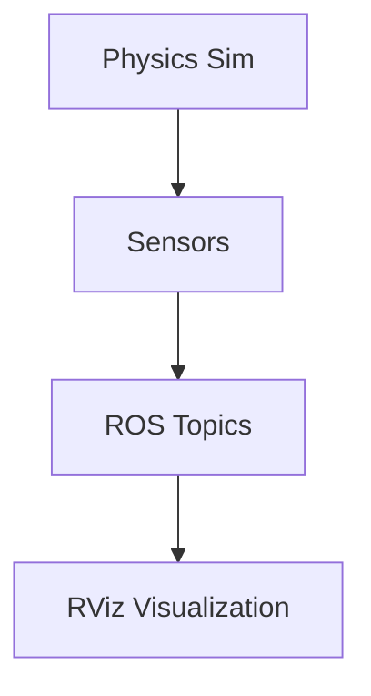

# Gazebo Harmonic Setup

This section covers the installation and configuration of Gazebo Harmonic for robotics simulation.

## Hardware Requirements

**Minimum System Requirements:**
- Ubuntu 22.04 LTS or later
- 8GB RAM (16GB recommended)
- 4+ CPU cores
- Dedicated GPU recommended for visualization

## Installation

To install Gazebo Harmonic with ROS 2 Humble support:

```bash
sudo apt update
sudo apt install ros-humble-ros-gz ros-humble-ros-gz-sim
```

## Verification

Verify the installation:

```bash
gz --version
ros2 pkg list | grep gz
```

## Launching an Empty World

To launch Gazebo with an empty world:

```bash
ros2 launch ros_gz_sim gz_sim.launch.py world_name:=empty.sdf
```

This will start the Gazebo simulation environment with basic physics enabled.

## Digital Twin Pipeline

The following diagram illustrates the Digital Twin pipeline:



## ROS 2 Bridge Setup

The ROS 2 bridge connects Gazebo simulation to ROS 2 ecosystem:

```bash
# Launch with ROS 2 bridge
ros2 launch ros_gz_sim gz_sim.launch.py world_name:=empty.sdf
```

## Physics Configuration

Configure physics parameters for realistic simulation:

```bash
# Set gravity (default is -9.8m/s^2)
gz service -s /world/empty/set_physics --reqtype gz.msgs.Physics --reptype gz.msgs.Boolean --timeout 5000 --req 'gravity: {x: 0.0, y: 0.0, z: -9.8}'
```

## Validation Commands

To visualize in RViz/Gazebo:

```bash
# Launch Gazebo simulation
ros2 launch ros_gz_sim gz_sim.launch.py world_name:=empty.sdf

# In another terminal, launch RViz for visualization
ros2 run rviz2 rviz2
```

## Practical Exercises

1. Install Gazebo Harmonic and verify the installation
2. Launch an empty world and observe the physics simulation
3. Configure gravity parameters and observe the changes
4. Launch RViz and connect to the simulation topics

For more information, refer to the [official Gazebo documentation](https://gazebosim.org/docs/harmonic).