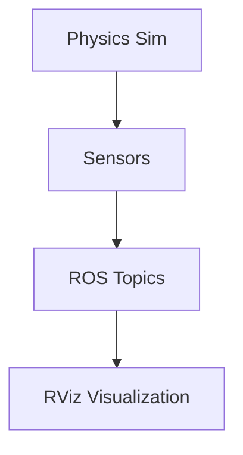

# URDF/SDF Humanoid Models

This section covers creating and importing humanoid robot models into Gazebo with proper &lt;gazebo&gt; tags configuration.

## Hardware Requirements

**Minimum System Requirements:**
- Ubuntu 22.04 LTS or later
- 8GB RAM (16GB recommended)
- 4+ CPU cores
- Dedicated GPU recommended for visualization

## Basic Humanoid URDF Example

Here's a basic example of a humanoid robot model with proper &lt;gazebo&gt; tags:

```xml
<?xml version="1.0"?>
<robot name="simple_humanoid">
  <!-- Links -->
  <link name="base_link">
    <visual>
      <geometry>
        <box size="0.2 0.1 0.1"/>
      </geometry>
    </visual>
    <collision>
      <geometry>
        <box size="0.2 0.1 0.1"/>
      </geometry>
    </collision>
    <inertial>
      <mass value="1.0"/>
      <inertia ixx="0.01" ixy="0.0" ixz="0.0" iyy="0.01" iyz="0.0" izz="0.01"/>
    </inertial>
  </link>

  <link name="head">
    <visual>
      <geometry>
        <sphere radius="0.05"/>
      </geometry>
    </visual>
    <collision>
      <geometry>
        <sphere radius="0.05"/>
      </geometry>
    </collision>
    <inertial>
      <mass value="0.2"/>
      <inertia ixx="0.0001" ixy="0.0" ixz="0.0" iyy="0.0001" iyz="0.0" izz="0.0001"/>
    </inertial>
  </link>

  <!-- Joints -->
  <joint name="head_joint" type="fixed">
    <parent link="base_link"/>
    <child link="head"/>
    <origin xyz="0 0 0.15"/>
  </joint>

  <!-- Gazebo-specific tags for simulation -->
  <gazebo reference="base_link">
    <material>Gazebo/Green</material>
  </gazebo>

  <gazebo reference="head">
    <material>Gazebo/Blue</material>
  </gazebo>
</robot>
```

## Spawning the Humanoid Model

To spawn the humanoid model in Gazebo:

```bash
# Launch Gazebo with empty world
ros2 launch ros_gz_sim gz_sim.launch.py world_name:=empty.sdf

# In another terminal, spawn the robot
ros2 run ros_gz_sim spawn_entity.py -entity simple_humanoid -file /path/to/humanoid.urdf
```

## Physics Configuration

To ensure proper physics behavior for humanoid models:

```xml
<gazebo>
  <static>false</static>
  <allow_auto_disable>true</allow_auto_disable>
  <self_collide>false</self_collide>
</gazebo>
```

## Digital Twin Pipeline

The following diagram illustrates the Digital Twin pipeline:



## Advanced Humanoid Model with Differential Drive

For more complex humanoid models, you might include a differential drive plugin:

```xml
<gazebo>
  <plugin filename="libgazebo_ros_diff_drive.so" name="gazebo_ros_diff_drive">
    <ros>
      <namespace>/robot</namespace>
      <remapping>cmd_vel:=cmd_vel</remapping>
      <remapping>odom:=odom</remapping>
    </ros>
    <left_joint>left_wheel_joint</left_joint>
    <right_joint>right_wheel_joint</right_joint>
    <wheel_separation>0.4</wheel_separation>
    <wheel_diameter>0.2</wheel_diameter>
    <max_wheel_torque>20</max_wheel_torque>
    <max_wheel_acceleration>1.0</max_wheel_acceleration>
    <publish_odom>true</publish_odom>
    <publish_odom_tf>true</publish_odom_tf>
    <publish_wheel_tf>true</publish_wheel_tf>
    <odometry_frame>odom</odometry_frame>
    <robot_base_frame>base_link</robot_base_frame>
  </plugin>
</gazebo>
```

## Validation Steps for Physics Behavior

To validate that the humanoid model behaves correctly with physics:

```bash
# Launch Gazebo with the humanoid model
ros2 launch ros_gz_sim gz_sim.launch.py world_name:=empty.sdf &
ros2 run ros_gz_sim spawn_entity.py -entity simple_humanoid -file /path/to/humanoid.urdf

# Check if the model is affected by gravity
# Verify joint constraints are working properly
# Test collision detection
```

## Practical Exercises

1. Create a simple humanoid URDF model with proper &lt;gazebo&gt; tags
2. Spawn the model in Gazebo and observe its behavior
3. Test the physics properties and joint constraints
4. Experiment with different materials and visual properties

For more information, refer to the [official ROS URDF tutorials](https://docs.ros.org/en/humble/Tutorials/Intermediate/URDF/Building-a-Visual-Robot-Model-with-URDF.html).