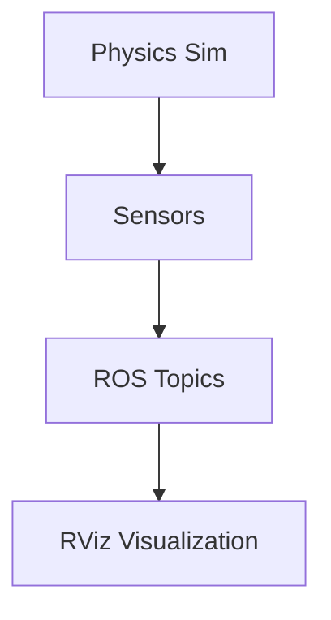

# Sensor Plugins

This section covers implementation of sensor simulation (LiDAR, Depth Camera, IMU) in Gazebo using plugins.

## Hardware Requirements

**Minimum System Requirements:**
- Ubuntu 22.04 LTS or later
- 8GB RAM (16GB recommended)
- 4+ CPU cores
- Dedicated GPU recommended for visualization

## LiDAR Sensor Plugin

To add a LiDAR sensor to your robot model, include the following in your URDF:

```xml
<link name="lidar_link">
  <visual>
    <geometry>
      <cylinder radius="0.05" length="0.04"/>
    </geometry>
  </visual>
  <collision>
    <geometry>
      <cylinder radius="0.05" length="0.04"/>
    </geometry>
  </collision>
  <inertial>
    <mass value="0.1"/>
    <inertia ixx="0.001" ixy="0.0" ixz="0.0" iyy="0.001" iyz="0.0" izz="0.001"/>
  </inertial>
</link>

<joint name="lidar_joint" type="fixed">
  <parent link="base_link"/>
  <child link="lidar_link"/>
  <origin xyz="0.1 0 0.05" rpy="0 0 0"/>
</joint>

<gazebo reference="lidar_link">
  <sensor type="ray" name="lidar_sensor">
    <pose>0 0 0 0 0 0</pose>
    <visualize>true</visualize>
    <update_rate>10</update_rate>
    <ray>
      <scan>
        <horizontal>
          <samples>360</samples>
          <resolution>1.0</resolution>
          <min_angle>-3.14159</min_angle>
          <max_angle>3.14159</max_angle>
        </horizontal>
      </scan>
      <range>
        <min>0.1</min>
        <max>30.0</max>
        <resolution>0.01</resolution>
      </range>
    </ray>
    <plugin filename="libgazebo_ros_ray_sensor.so" name="gazebo_ros_head_lidar">
      <ros>
        <namespace>/robot</namespace>
        <remapping>scan:=/scan</remapping>
      </ros>
      <output_type>sensor_msgs/LaserScan</output_type>
    </plugin>
  </sensor>
</gazebo>
```

## Camera Sensor Plugin

To add a depth camera sensor:

```xml
<link name="camera_link">
  <visual>
    <geometry>
      <box size="0.02 0.04 0.02"/>
    </geometry>
  </visual>
  <collision>
    <geometry>
      <box size="0.02 0.04 0.02"/>
    </geometry>
  </collision>
  <inertial>
    <mass value="0.01"/>
    <inertia ixx="1e-06" ixy="0.0" ixz="0.0" iyy="1e-06" iyz="0.0" izz="1e-06"/>
  </inertial>
</link>

<joint name="camera_joint" type="fixed">
  <parent link="base_link"/>
  <child link="camera_link"/>
  <origin xyz="0.1 0 0.1" rpy="0 0 0"/>
</joint>

<gazebo reference="camera_link">
  <sensor type="depth" name="camera_sensor">
    <pose>0 0 0 0 0 0</pose>
    <visualize>true</visualize>
    <update_rate>15</update_rate>
    <camera>
      <horizontal_fov>1.047</horizontal_fov>
      <image>
        <width>640</width>
        <height>480</height>
        <format>R8G8B8</format>
      </image>
      <clip>
        <near>0.1</near>
        <far>10</far>
      </clip>
    </camera>
    <plugin filename="libgazebo_ros_camera.so" name="gazebo_ros_camera">
      <ros>
        <namespace>/robot</namespace>
        <remapping>image_raw:=/camera/image_raw</remapping>
        <remapping>camera_info:=/camera/camera_info</remapping>
      </ros>
      <camera_name>camera</camera_name>
      <frame_name>camera_link</frame_name>
      <min_depth>0.1</min_depth>
      <max_depth>10.0</max_depth>
    </plugin>
  </sensor>
</gazebo>
```

## IMU Sensor Plugin

To add an IMU sensor:

```xml
<link name="imu_link">
  <visual>
    <geometry>
      <box size="0.01 0.01 0.01"/>
    </geometry>
  </visual>
  <collision>
    <geometry>
      <box size="0.01 0.01 0.01"/>
    </geometry>
  </collision>
  <inertial>
    <mass value="0.01"/>
    <inertia ixx="1e-06" ixy="0.0" ixz="0.0" iyy="1e-06" iyz="0.0" izz="1e-06"/>
  </inertial>
</link>

<joint name="imu_joint" type="fixed">
  <parent link="base_link"/>
  <child link="imu_link"/>
  <origin xyz="0 0 0.05" rpy="0 0 0"/>
</joint>

<gazebo reference="imu_link">
  <sensor type="imu" name="imu_sensor">
    <always_on>true</always_on>
    <update_rate>100</update_rate>
    <visualize>false</visualize>
    <plugin filename="libgazebo_ros_imu.so" name="gazebo_ros_imu">
      <ros>
        <namespace>/robot</namespace>
        <remapping>imu:=/imu</remapping>
      </ros>
      <frame_name>imu_link</frame_name>
      <initial_orientation_as_reference>false</initial_orientation_as_reference>
    </plugin>
  </sensor>
</gazebo>
```

## Digital Twin Pipeline

The following diagram illustrates the Digital Twin pipeline:



## Visualizing Sensor Data in RViz

To visualize sensor data in RViz:

```bash
# Launch RViz
ros2 run rviz2 rviz2

# Add displays for sensor topics:
# - LaserScan for LiDAR data (/robot/scan)
# - Image for camera data (/robot/camera/image_raw)
# - Imu for IMU data (/robot/imu)
```

## Validation Steps for Sensor Data Output

To validate that sensor data is being generated correctly:

```bash
# Launch the simulation with sensors
ros2 launch ros_gz_sim gz_sim.launch.py world_name:=empty.sdf

# In another terminal, check if sensor topics are being published
ros2 topic list | grep -E "(scan|camera|imu)"

# Listen to specific sensor topics
ros2 topic echo /robot/scan sensor_msgs/msg/LaserScan
ros2 topic echo /robot/camera/image_raw sensor_msgs/msg/Image
ros2 topic echo /robot/imu sensor_msgs/msg/Imu
```

## Practical Exercises

1. Add a LiDAR sensor to your robot model and verify data publication
2. Add a camera sensor and visualize the image stream in RViz
3. Add an IMU sensor and check orientation data
4. Combine multiple sensors and observe all data streams simultaneously

For more information, refer to the [official Gazebo sensor documentation](https://gazebosim.org/docs/harmonic/sensors).