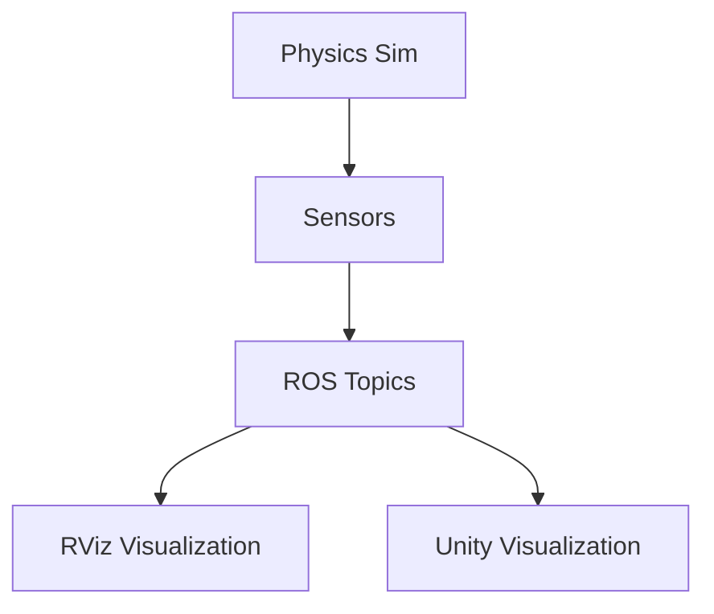

# Unity Integration

This section provides an introduction to Unity for high-fidelity rendering and human-robot interaction with ROS TCP connector.

## Hardware Requirements

**Minimum System Requirements:**
- Ubuntu 22.04 LTS or later
- 8GB RAM (16GB recommended)
- 4+ CPU cores
- Dedicated GPU with OpenGL 3.3+ or Vulkan support

## Unity Robotics Hub Setup

To set up Unity for robotics applications:

1. Install Unity Hub from the [Unity website](https://unity.com/download)
2. Install Unity Editor (2021.3 LTS or later recommended)
3. Clone the Unity Robotics Hub:

```bash
git clone https://github.com/Unity-Technologies/Unity-Robotics-Hub.git
```

## ROS TCP Connector Configuration

The ROS TCP Connector enables communication between Unity and ROS 2:

1. Import the ROS TCP Connector package into your Unity project
2. Add the ROSConnection object to your Unity scene
3. Configure the IP address and port:

```csharp
using Unity.Robotics.ROSTCPConnector;

public class RobotController : MonoBehaviour
{
    ROSConnection ros;

    void Start()
    {
        ros = ROSConnection.instance;
        ros.rosIPAddress = "127.0.0.1";  // ROS 2 machine IP
        ros.rosPort = 10000;             // ROS TCP port
    }
}
```

## High-Fidelity Rendering

Unity provides advanced rendering capabilities for robotics simulation:

- Physically Based Rendering (PBR) materials
- Realistic lighting and shadows
- Post-processing effects
- Advanced camera systems

## Digital Twin Pipeline

The following diagram illustrates the Digital Twin pipeline:



## Human-Robot Interaction

Unity enables intuitive human-robot interaction through:

- VR/AR interfaces
- Custom control panels
- Interactive environments
- Real-time visualization

## Connecting Unity to ROS 2

To establish connection between Unity and ROS 2:

1. Start your ROS 2 system
2. Launch the ROS TCP Connector bridge
3. Start Unity application
4. Verify communication by sending/receiving messages

The Unity-ROS connection enables bidirectional communication for high-fidelity visualization and control of robotic systems.

## Validation Steps for Unity-ROS Connection

To validate the Unity-ROS connection:

```bash
# First, ensure your ROS 2 system is running
source /opt/ros/humble/setup.bash
source install/setup.bash

# Launch your robot simulation
ros2 launch ros_gz_sim gz_sim.launch.py world_name:=empty.sdf

# In Unity, run your scene and check the connection
# Verify that messages can be sent and received between Unity and ROS 2
```

## Practical Exercises

1. Set up the Unity Robotics Hub and import the ROS TCP Connector
2. Create a simple Unity scene that connects to ROS 2
3. Visualize robot sensor data in Unity
4. Implement basic robot control from Unity interface

For more information, refer to the [Unity Robotics documentation](https://github.com/Unity-Technologies/Unity-Robotics-Hub).

## Summary

This chapter covered the complete digital twin pipeline using Gazebo Harmonic for physics simulation and Unity for high-fidelity rendering. You learned to:

- Set up Gazebo Harmonic with ROS 2 bridge
- Create humanoid robot models with proper URDF and &lt;gazebo&gt; tags
- Implement sensor simulation (LiDAR, Camera, IMU) in Gazebo
- Integrate Unity for high-fidelity visualization and human-robot interaction

These tools form a comprehensive simulation environment for developing and testing humanoid robotics applications.