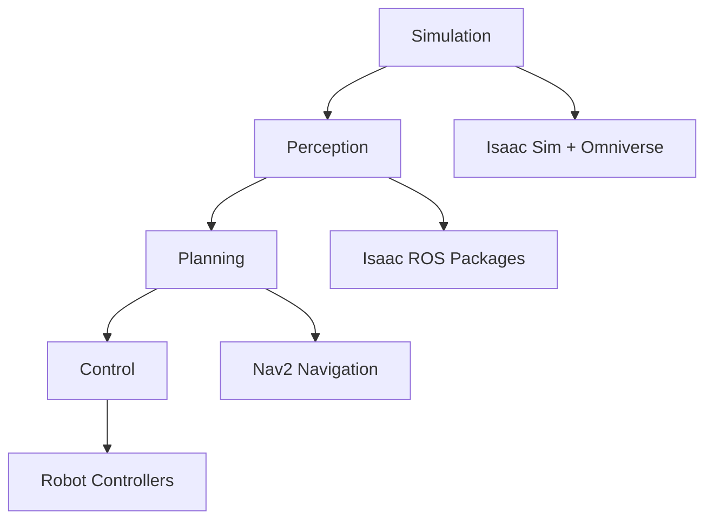
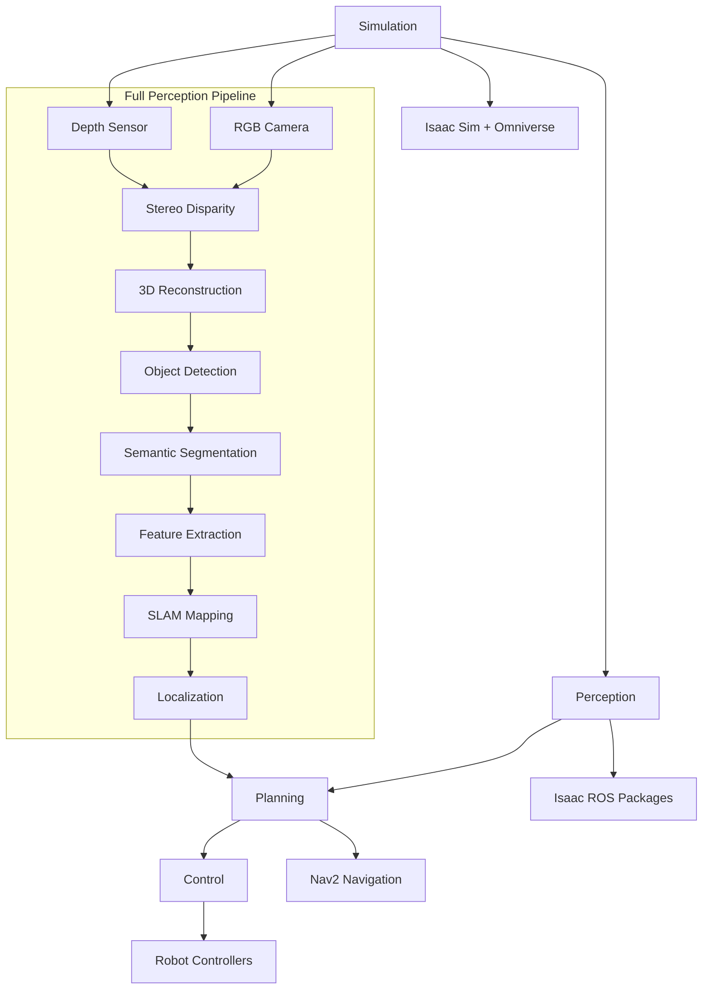
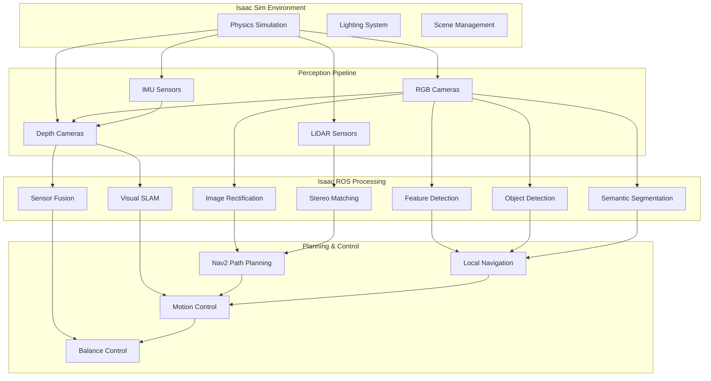

# Isaac Sim Setup & Humanoid Spawn

## Prerequisites

Before starting with NVIDIA Isaac Sim, ensure your system meets the following requirements:

### Hardware Requirements
- **GPU**: NVIDIA RTX 3080 or equivalent (10GB+ VRAM recommended)
- **CPU**: 8+ cores (Intel i7 or AMD Ryzen 7 equivalent)
- **RAM**: 32GB or more
- **Storage**: 100GB+ free space for Isaac Sim installation
- **OS**: Ubuntu 22.04 LTS

### Software Dependencies
- NVIDIA GPU drivers (535 or later)
- CUDA 11.8 or later
- ROS 2 Humble Hawksbill
- Docker and NVIDIA Container Toolkit
- Omniverse Launcher (for Isaac Sim)

### RTX Hardware Requirements Table

| GPU Model | VRAM | Performance Level | Recommendation | Use Case |
|-----------|------|------------------|----------------|----------|
| RTX 3060 (12GB) | 12GB | Basic simulation | Minimum viable | Simple scenes, basic physics |
| RTX 3080 (10/12GB) | 10-12GB | Good performance | Recommended | Standard development |
| RTX 4070 Ti (12GB) | 12GB | Good performance | Recommended | Standard development |
| RTX 4080 (16GB) | 16GB | High-quality rendering | Preferred | Complex scenes, detailed rendering |
| RTX 4090 (24GB) | 24GB | Maximum quality | Optimal | Advanced simulation, large environments |
| RTX 6000 Ada (48GB) | 48GB | Maximum quality | Enterprise | Large-scale simulation, multi-robot |

## Isaac Sim Installation

NVIDIA Isaac Sim runs on the Omniverse platform and provides a photorealistic simulation environment for robotics development. It integrates with the ROS ecosystem and provides accelerated perception capabilities through Isaac ROS packages.

### Installing Omniverse Launcher

1. Download the Omniverse Launcher from the [NVIDIA Developer website](https://developer.nvidia.com/isaac/sim)
2. Follow the installation instructions for your operating system
3. Launch Omniverse Launcher and sign in with your NVIDIA Developer account
4. Install Isaac Sim through the launcher

### Isaac Sim Extensions for Robotics

Isaac Sim includes several extensions specifically for robotics simulation:

- **Isaac ROS Bridge**: Connects Isaac Sim to ROS 2 ecosystem
- **Robot Library**: Pre-built robot models and components
- **Sensors**: Physics-accurate sensor simulation (cameras, LiDAR, IMU, etc.)
- **Actuators**: Joint control and motor simulation
- **Environment**: Terrain and scene simulation tools

### Launching Isaac Sim

To launch Isaac Sim from the command line:

```bash
# Launch Isaac Sim with the default configuration
isaac-sim --exec Isaac.Sim.Sandbox

# Alternative: Launch with custom configuration
isaac-sim --config /path/to/config.json
```

Or use the Omniverse Launcher GUI to manage your Isaac Sim installations and launch configurations.

### Isaac Sim Extensions Setup

Enable required robotics extensions in Isaac Sim:

```python
# Python script to enable Isaac Sim extensions
import omni
import carb

# Enable core robotics extensions
extensions = [
    "omni.isaac.ros2_bridge.humble",
    "omni.isaac.robot_library",
    "omni.isaac.range_sensor",
    "ommi.isaac.sensor",
]

for ext in extensions:
    omni.kit.app.get_app().extension_manager.set_enabled(ext, True)
```

## Isaac ROS Workspace Setup

The Isaac ROS packages provide accelerated perception, navigation, and manipulation capabilities using NVIDIA hardware acceleration. To set up your Isaac ROS workspace:

```bash
# Create workspace directory
mkdir -p ~/isaac_ros_ws/src
cd ~/isaac_ros_ws

# Source ROS 2 Humble
source /opt/ros/humble/setup.bash

# Clone Isaac ROS packages for visual SLAM
git clone -b ros2 https://github.com/NVIDIA-ISAAC-ROS/isaac_ros_visual_slam.git src/isaac_ros_visual_slam

# Clone additional Isaac ROS packages as needed
git clone -b ros2 https://github.com/NVIDIA-ISAAC-ROS/isaac_ros_messages.git src/isaac_ros_messages
git clone -b ros2 https://github.com/NVIDIA-ISAAC-ROS/isaac_ros_common.git src/isaac_ros_common

# Build the workspace
colcon build --symlink-install --packages-select \
  isaac_ros_visual_slam \
  isaac_ros_messages \
  isaac_ros_common

# Source the workspace
source install/setup.bash

# Verify installation
ros2 pkg list | grep isaac
```

### Isaac ROS on Jetson/RTX Platforms

For deployment on edge platforms like NVIDIA Jetson or RTX systems, consider these optimizations:

```bash
# For Jetson platforms, use specific branches optimized for JetPack
git clone -b ros2-jetpack-5.1 https://github.com/NVIDIA-ISAAC-ROS/isaac_ros_visual_slam.git src/isaac_ros_visual_slam

# Build with CUDA optimizations for RTX hardware
colcon build --symlink-install \
  --cmake-args -DCMAKE_BUILD_TYPE=Release \
  -DCUDA_ARCHITECTURES="75;86;89"  # For RTX 30/40 series
```

## USD Asset Loading

Universal Scene Description (USD) is the native format for Omniverse and Isaac Sim. To load humanoid USD assets like the Fourier H1:

1. Download USD humanoid models from the Isaac Sim asset library
2. Place USD files in the appropriate Isaac Sim assets directory
3. Import assets directly into Isaac Sim through the GUI or via Python API

### Loading Humanoid Models

For humanoid robots like Fourier H1, ensure proper joint configuration:

```python
# Example Python API usage for loading USD assets with joint configuration
import omni
from pxr import UsdGeom, Sdf
import carb

# Get the current stage
stage = omni.usd.get_context().get_stage()

# Define the USD path for your humanoid model
usd_path = "/path/to/fourier_h1.usd"

# Reference the USD file in the current stage
prim = stage.DefinePrim("/World/FourierH1", "Xform")
prim.GetReferences().AddReference(usd_path)

# Configure joint properties for realistic movement
joint_paths = [
    "/World/FourierH1/LeftHip",
    "/World/FourierH1/RightHip",
    "/World/FourierH1/LeftKnee",
    "/World/FourierH1/RightKnee"
]

for joint_path in joint_paths:
    joint_prim = stage.GetPrimAtPath(joint_path)
    if joint_prim.IsValid():
        # Set joint limits and properties
        carb.log_info(f"Configured joint: {joint_path}")
```

### USD Asset Directory Structure

Organize your USD assets for easy access:

```
isaac_sim/
├── assets/
│   ├── robots/
│   │   ├── fourier/
│   │   │   └── fourier_h1.usd
│   │   ├── atlas/
│   │   │   └── atlas_v5.usd
│   │   └── spot/
│   │       └── spot.usd
│   ├── environments/
│   │   ├── office/
│   │   │   └── office.usd
│   │   └── warehouse/
│   │       └── warehouse.usd
│   └── objects/
│       ├── furniture/
│       └── props/
```

## Isaac Sim First Launch Tutorial

Now that your environment is set up, let's launch Isaac Sim and create your first simulation:

### Step 1: Launch Isaac Sim
```bash
# Launch Isaac Sim with the Sandbox environment
isaac-sim --exec Isaac.Sim.Sandbox

# Or launch with specific configuration
isaac-sim --enable "omni.kit.window.viewport" --exec Isaac.Sim.Sandbox
```

### Step 2: Create a New Scene
1. Once Isaac Sim is running, create a new stage (File → New Stage)
2. Set up the basic environment by adding a ground plane:
   - In the Stage window, right-click and select "Create → Ground Plane"
   - Adjust the size to 10x10 meters

### Step 3: Configure Physics
1. Enable physics simulation by adding PhysX scene:
   - In the Stage window, right-click and select "Create → Physics → PhysX Scene"
   - Configure gravity to -9.8 m/s² in the Z direction

### Step 4: Add Lighting
1. Add an environment light:
   - Create → Environment Light → Distant Light
   - Adjust the intensity and direction for optimal visibility

## Isaac Pipeline Architecture

The Isaac Platform follows a comprehensive pipeline architecture for robotics simulation and development:



This architecture enables seamless integration from photorealistic simulation through perception, planning, and control to real-world robot deployment.

## Full Perception Pipeline

For a more comprehensive view of the perception capabilities:



## Isaac Pipeline Architecture with Full Perception Flow

Here's an expanded view of the complete Isaac Pipeline with all perception components:



## Humanoid Robot Spawning

### Using the Robot Library

The easiest way to spawn humanoid robots is through Isaac Sim's Robot Library:

1. Open the Robot Library window (Window → Quick Access → Robot Library)
2. Browse available humanoid models (Fourier H1, Atlas, etc.)
3. Drag and drop the desired robot into your scene
4. The robot will be properly configured with joints, actuators, and sensors

### Spawning via Python API

For programmatic robot spawning:

```python
# Python script to spawn a humanoid robot
import omni
from omni.isaac.core import World
from omni.isaac.core.utils.nucleus import get_assets_root_path
from omni.isaac.core.utils.stage import add_reference_to_stage
import carb

# Get the world instance
world = World()

# Add a humanoid robot to the stage
# Example: Spawn a simple humanoid model
robot_path = "/path/to/humanoid_model.usd"
add_reference_to_stage(robot_path, "/World/HumanoidRobot")

# Initialize the world
world.reset()

# Access robot joints for control
robot = world.scene.get_object("HumanoidRobot")
carb.log_info("Humanoid robot spawned successfully")
```

### Spawning via ROS 2

You can also spawn robots using ROS 2 commands with the Isaac ROS bridge:

```bash
# Spawn a robot using ROS 2
ros2 run isaac_ros_apriltag_interfaces spawn_robot --ros-args \
  -p robot_description:="/path/to/robot/urdf" \
  -p spawn_position:="[0.0, 0.0, 1.0]"
```

## Troubleshooting Common Issues

### VRAM Issues
- Reduce rendering resolution in Isaac Sim settings
- Disable some visual effects (shadows, reflections, etc.)
- Consider using lower-poly models during development
- Close other GPU-intensive applications

### CUDA Errors
- Verify NVIDIA drivers are properly installed: `nvidia-smi`
- Check CUDA version: `nvcc --version`
- Ensure Isaac ROS packages are built with the correct CUDA version
- Verify compatible GPU compute capability (Isaac Sim requires 7.5+)

### Isaac Sim Launch Issues
- **"Isaac Sim fails to start"**: Check if another application is using the GPU exclusively
- **"Extensions fail to load"**: Verify Isaac Sim installation path and permissions
- **"Black screen/No rendering"**: Update graphics drivers or try launching with `isaac-sim --/renderer/disable_scene_updates=1`
- **"Python API not working"**: Ensure Isaac Sim Python path is in your PYTHONPATH

### Isaac ROS Bridge Issues
- **"Bridge not connecting"**: Verify ROS 2 humble is sourced in the same terminal
- **"Missing message types"**: Ensure isaac_ros_messages are built and sourced
- **"Performance issues"**: Check network bandwidth if using distributed systems

### ROS Connection Issues
- Verify ROS_DOMAIN_ID is consistent across all terminals
- Check network configuration if using distributed systems
- Ensure Isaac ROS bridge is properly configured
- Use `ros2 topic list` to verify topics are being published from Isaac Sim

## Practical Exercise

Complete the following exercise to verify your Isaac Sim installation:

### Exercise 1: Basic Isaac Sim Setup
1. Launch Isaac Sim using the Sandbox environment: `isaac-sim --exec Isaac.Sim.Sandbox`
2. Create a new stage (File → New Stage)
3. Add a ground plane and PhysX scene for physics simulation
4. Add proper lighting to the scene
5. Save the stage as "basic_scene.usd"

### Exercise 2: Humanoid Robot Spawn
1. Open the Robot Library (Window → Quick Access → Robot Library)
2. Select and spawn a humanoid robot model in your scene
3. Verify the robot's joints are properly configured
4. Run the simulation to observe basic physics interactions
5. Try moving the robot using Isaac Sim's transform tools

### Exercise 3: Isaac ROS Bridge Test
1. Source your Isaac ROS workspace: `source ~/isaac_ros_ws/install/setup.bash`
2. Launch Isaac Sim with ROS bridge enabled
3. In another terminal, verify ROS topics are available: `ros2 topic list`
4. Check for robot-related topics like `/joint_states`, `/tf`, etc.

Document your results and any challenges encountered during the setup process. Pay special attention to:
- Time taken for each step
- Any error messages encountered
- Performance observations (frame rate, responsiveness)
- Successful completion of physics simulation

## Summary

This section covered the foundational setup for NVIDIA Isaac Sim, including hardware requirements, installation procedures, and basic workspace configuration. The next section will explore synthetic data generation using Isaac Replicator.

## Troubleshooting Isaac Platform Integration

### Common Integration Issues

- **Isaac Sim and ROS Bridge Not Communicating**: Verify that the Isaac ROS Bridge extension is enabled and that both Isaac Sim and ROS 2 environments are properly sourced in the same terminal
- **Missing Isaac ROS Messages**: Ensure the isaac_ros_messages package is built and sourced
- **Performance Issues with Isaac Sim**: Close other GPU-intensive applications and verify VRAM availability
- **Camera Topics Not Publishing**: Check that Isaac Sim cameras are properly configured with ROS bridge connections

### Integration Debugging Commands

```bash
# Check Isaac Sim ROS bridge status
ros2 topic list | grep isaac

# Verify Isaac ROS packages are accessible
ros2 pkg list | grep isaac

# Check for common connection issues
ros2 topic echo /tf --field transforms -n 5
```

## Cross-References

- [Chapter 4.2: Synthetic Data Generation](./02-synthetic-data.mdx) - Learn how to use Isaac Replicator for domain randomization
- [Chapter 4.3: Visual SLAM Pipeline](./03-isaac-ros-vslam.mdx) - Implement cuVSLAM for real-time localization and mapping
- [Chapter 4.4: Nav2 Integration](./04-nav2-sim-to-real.mdx) - Configure Nav2 for bipedal navigation and sim-to-real concepts

## Official NVIDIA Isaac Resources

- [NVIDIA Isaac Sim Documentation](https://docs.omniverse.nvidia.com/isaacsim/latest/overview.html) - Complete Isaac Sim documentation
- [NVIDIA Isaac ROS Documentation](https://nvidia-isaac-ros.github.io/) - Isaac ROS packages documentation
- [NVIDIA Developer - Isaac](https://developer.nvidia.com/isaac) - Official Isaac platform resources
- [Isaac ROS GitHub Repository](https://github.com/NVIDIA-ISAAC-ROS) - Source code and examples
- [NVIDIA Omniverse Documentation](https://docs.omniverse.nvidia.com/) - Omniverse platform documentation

## Setup Validation Checklist

### Isaac Sim Installation Validation
- [ ] Isaac Sim launches successfully from command line: `isaac-sim --exec Isaac.Sim.Sandbox`
- [ ] Omniverse Launcher shows Isaac Sim as installed and active
- [ ] GPU acceleration is functioning (check with `nvidia-smi` during simulation)
- [ ] Isaac Sim extensions load without errors
- [ ] Robot Library is accessible through Isaac Sim UI
- [ ] USD assets can be loaded into the scene

### Isaac ROS Workspace Validation
- [ ] Isaac ROS packages build successfully with `colcon build`
- [ ] Isaac ROS packages appear in `ros2 pkg list | grep isaac`
- [ ] Isaac ROS workspace sources without errors: `source install/setup.bash`
- [ ] Isaac ROS extensions are available in Isaac Sim: `omni.isaac.ros2_bridge.humble`
- [ ] Basic ROS 2 communication works between Isaac Sim and ROS 2 environment
- [ ] Camera and sensor topics are publishing data when Isaac Sim is running

## Isaac Platform Glossary

### A
- **Annotation**: Labels or metadata associated with synthetic data (e.g., bounding boxes, segmentation masks, depth maps)
- **API**: Application Programming Interface - a set of rules and protocols for building and interacting with software applications

### C
- **CUDA**: Compute Unified Device Architecture - NVIDIA's parallel computing platform and API for general computing on GPUs
- **cuVSLAM**: CUDA-accelerated Visual Simultaneous Localization and Mapping

### D
- **Domain Randomization**: Technique to improve sim-to-real transfer by randomizing simulation parameters to create diverse training data
- **Depth Sensor**: Sensor that captures distance information from the sensor to objects in the scene

### G
- **GPU Acceleration**: Use of Graphics Processing Units to accelerate computations, especially important for rendering and perception tasks
- **Ground Truth**: Accurate reference data used for training and validation, typically generated automatically in simulation

### I
- **Isaac ROS**: Collection of ROS 2 packages that provide accelerated perception, navigation, and manipulation capabilities using NVIDIA hardware
- **Isaac Sim**: NVIDIA's robotics simulator built on the Omniverse platform providing photorealistic simulation environments

### L
- **LiDAR**: Light Detection and Ranging - a remote sensing method using light in the form of a pulsed laser to measure distances

### M
- **Meridian**: NVIDIA's Isaac Sim extension for ROS 2 integration, allowing bidirectional communication between Isaac Sim and ROS 2
- **ML**: Machine Learning - algorithms that learn patterns from data to make predictions or decisions

### O
- **Omniverse**: NVIDIA's platform for 3D design collaboration and world simulation
- **OpenUSD**: Open Universal Scene Description - an extensible, open-source framework for interchange of 3D scenes and assets

### P
- **Photorealistic**: Visually indistinguishable from a photograph, used to describe high-fidelity rendering in simulations
- **Perception Pipeline**: Series of processing steps that convert raw sensor data into meaningful information for the robot

### R
- **ROS 2**: Robot Operating System 2 - a flexible framework for writing robot software
- **RTX**: NVIDIA's graphics card line featuring real-time ray tracing and AI capabilities

### S
- **SLAM**: Simultaneous Localization and Mapping - the computational problem of constructing or updating a map of an unknown environment
- **Stereo Vision**: Technique using two cameras to estimate depth information through triangulation
- **Synthetic Data**: Artificially generated data that mimics real-world data, often used for training AI models

### U
- **USD**: Universal Scene Description - Pixar's format for interchange of 3D computer graphics data
- **URDF**: Unified Robot Description Format - an XML format for representing a robot model

### V
- **VSLAM**: Visual Simultaneous Localization and Mapping - SLAM using visual sensors like cameras
- **VRAM**: Video Random Access Memory - specialized memory used by graphics cards for rendering

## Performance Benchmarks and Hardware Recommendations

### Isaac Sim Performance Benchmarks

| Hardware Configuration | Rendering FPS | Physics Simulation | Max Objects Supported | Recommended Use Case |
|------------------------|---------------|--------------------|----------------------|---------------------|
| RTX 3060 (12GB) | 30-45 FPS | Real-time | ~100 | Basic simulations, learning |
| RTX 3080 (10/12GB) | 45-60 FPS | Real-time | ~200 | Standard development |
| RTX 4070 Ti (12GB) | 50-70 FPS | Real-time | ~250 | Advanced development |
| RTX 4080 (16GB) | 60-80 FPS | Real-time | ~400 | Complex environments |
| RTX 4090 (24GB) | 70-100 FPS | Real-time | ~600 | Advanced research |
| RTX 6000 Ada (48GB) | 80-120 FPS | Real-time | ~1000 | Large-scale simulation |

### Isaac Sim Hardware Recommendations

#### Minimum Requirements
- **GPU**: RTX 3060 with 12GB VRAM
- **CPU**: Intel i7-10700K or AMD Ryzen 7 3700X (8 cores, 16 threads)
- **RAM**: 32GB DDR4
- **Storage**: 100GB SSD for Isaac Sim installation
- **OS**: Ubuntu 22.04 LTS

#### Recommended Requirements
- **GPU**: RTX 4080 with 16GB+ VRAM
- **CPU**: Intel i9-12900K or AMD Ryzen 9 5900X (16 cores, 24+ threads)
- **RAM**: 64GB DDR4/DDR5
- **Storage**: 500GB NVMe SSD
- **OS**: Ubuntu 22.04 LTS

#### High-Performance Requirements
- **GPU**: RTX 6000 Ada or dual RTX 4090
- **CPU**: Intel Xeon or AMD EPYC processor
- **RAM**: 128GB+ DDR4/DDR5
- **Storage**: 1TB+ NVMe SSD RAID configuration
- **OS**: Ubuntu 22.04 LTS with real-time kernel

### Isaac ROS Performance Benchmarks

| Platform | Visual SLAM Processing | Replicator Throughput | Max Features Tracked | Power Consumption |
|----------|------------------------|----------------------|---------------------|-------------------|
| RTX 3060 Laptop | 15-20 FPS | 2-5 images/sec | 500-800 features | 80-100W |
| RTX 3080 Desktop | 30-40 FPS | 10-15 images/sec | 1000-1500 features | 200-250W |
| RTX 4080 Desktop | 40-50 FPS | 20-30 images/sec | 1500-2000 features | 280-320W |
| RTX 4090 Desktop | 50-70 FPS | 30-50 images/sec | 2000+ features | 350-400W |
| Jetson AGX Orin | 15-25 FPS | 5-10 images/sec | 800-1200 features | 30-60W |
| Jetson Orin NX | 10-15 FPS | 3-5 images/sec | 500-800 features | 15-25W |