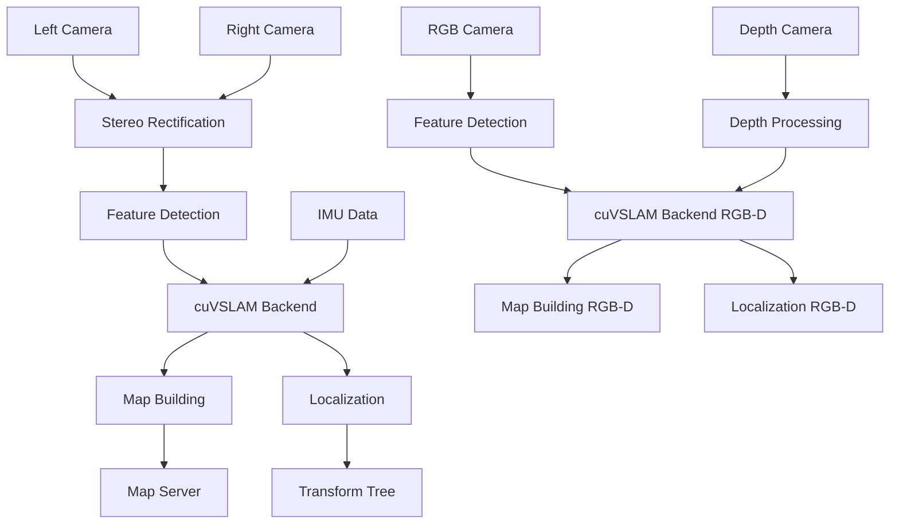

# Visual SLAM Pipeline with Isaac ROS

## Introduction to Isaac ROS Visual SLAM

The Isaac ROS Visual SLAM package provides GPU-accelerated visual SLAM capabilities using NVIDIA hardware. It includes cuVSLAM (CUDA-accelerated visual SLAM) and integrates seamlessly with ROS 2 Humble for real-time mapping and localization in robotics applications.

### Key Features
- CUDA-accelerated visual SLAM for real-time performance
- Support for stereo cameras and RGB-D sensors
- Integration with ROS 2 ecosystem
- Optimized for Jetson and RTX platforms

## Installing Isaac ROS Visual SLAM

### Prerequisites
- ROS 2 Humble Hawksbill
- Isaac Sim installed and configured
- NVIDIA GPU with compute capability 7.5 or higher
- CUDA 11.8 or later

### Installation Steps

```bash
# Create or navigate to your Isaac ROS workspace
mkdir -p ~/isaac_ros_ws/src
cd ~/isaac_ros_ws

# Source ROS 2 Humble
source /opt/ros/humble/setup.bash

# Clone Isaac ROS Visual SLAM packages
git clone -b ros2 https://github.com/NVIDIA-ISAAC-ROS/isaac_ros_visual_slam.git src/isaac_ros_visual_slam
git clone -b ros2 https://github.com/NVIDIA-ISAAC-ROS/isaac_ros_messages.git src/isaac_ros_messages
git clone -b ros2 https://github.com/NVIDIA-ISAAC-ROS/isaac_ros_common.git src/isaac_ros_common
git clone -b ros2 https://github.com/NVIDIA-ISAAC-ROS/isaac_ros_image_proc.git src/isaac_ros_image_proc

# Build the packages
colcon build --symlink-install --packages-select \
  isaac_ros_visual_slam \
  isaac_ros_messages \
  isaac_ros_common \
  isaac_ros_image_proc

# Source the workspace
source install/setup.bash
```

### Isaac ROS Visual SLAM on Jetson Platforms

For Jetson platforms, use specific branches optimized for JetPack:

```bash
# For Jetson platforms, use JetPack-optimized branches
git clone -b ros2-jetpack-5.1 https://github.com/NVIDIA-ISAAC-ROS/isaac_ros_visual_slam.git src/isaac_ros_visual_slam

# Build with CUDA optimizations for Jetson
colcon build --symlink-install \
  --cmake-args -DCMAKE_BUILD_TYPE=Release \
  -DCUDA_ARCHITECTURES="72"  # For Jetson (typically compute capability 7.2)
```

### Isaac ROS Visual SLAM on RTX Platforms

For RTX platforms, optimize for the specific GPU architecture:

```bash
# Build with CUDA optimizations for RTX hardware
colcon build --symlink-install \
  --cmake-args -DCMAKE_BUILD_TYPE=Release \
  -DCUDA_ARCHITECTURES="75;86;89"  # For RTX 20/30/40 series
```

## cuVSLAM Configuration

### Launching Isaac ROS Visual SLAM

The Isaac ROS Visual SLAM package provides several launch files for different configurations:

```bash
# Basic stereo visual SLAM launch
ros2 launch isaac_ros_visual_slam isaac_ros_visual_slam_stereo.launch.py

# Visual SLAM with Isaac Sim
ros2 launch isaac_ros_visual_slam isaac_ros_visual_slam_isaac_sim.launch.py

# RGB-D visual SLAM (for depth camera sensors)
ros2 launch isaac_ros_visual_slam isaac_ros_visual_slam_rgbd.launch.py
```

### Advanced cuVSLAM Configuration

For more sophisticated setups, configure additional parameters:

```yaml
# Advanced configuration file: advanced_visual_slam_params.yaml
visual_slam_node:
  ros__parameters:
    # Camera parameters
    camera_type: "stereo"  # or "rgbd"
    left_camera_topic: "/camera/left/image_rect_color"
    right_camera_topic: "/camera/right/image_rect_color"
    left_camera_info_topic: "/camera/left/camera_info"
    right_camera_info_topic: "/camera/right/camera_info"

    # Depth camera parameters (for RGB-D mode)
    rgb_camera_topic: "/camera/rgb/image_rect_color"
    depth_camera_topic: "/camera/depth/image_rect_raw"
    rgb_camera_info_topic: "/camera/rgb/camera_info"
    depth_camera_info_topic: "/camera/depth/camera_info"

    # SLAM parameters
    enable_localization: false
    enable_mapping: true
    use_sim_time: true  # Set to true when using Isaac Sim

    # Map parameters
    map_frame: "map"
    odom_frame: "odom"
    base_frame: "base_link"

    # Performance parameters
    max_num_landmarks: 1000
    max_map_size: 10000  # In meters
    min_num_stereo_features: 20
    max_num_stereo_features: 1000

    # Loop closure parameters
    enable_loop_closure: true
    loop_closure_detection_frequency: 1.0  # Hz
    min_loop_closure_inliers: 10
    loop_closure_reprojection_threshold: 3.0  # pixels

    # Tracking parameters
    tracking_min_inliers: 10
    tracking_max_reprojection_error: 4.0  # pixels
    tracking_outlier_rejection_threshold: 3.84

    # Feature management
    feature_detector_type: "ShiTomasi"  # Options: "ShiTomasi", "FAST"
    descriptor_extractor_type: "ORB"    # Options: "ORB", "SIFT", "SURF"
    max_num_keypoints: 1000
    min_keypoint_distance: 10.0  # pixels

    # IMU integration (if available)
    enable_imu: true
    imu_topic: "/imu/data"
    imu_dq_threshold: 0.1
    imu_dt_threshold: 0.05

    # Optimization parameters
    num_solver_iterations: 5
    use_pnp_pose_optimizer: true
    pnp_reprojection_error: 8.0  # pixels
```

### Runtime Parameter Adjustments

Adjust parameters at runtime using ROS 2 services:

```bash
# Set a parameter at runtime
ros2 param set /visual_slam_node max_num_landmarks 1500

# Get current parameter values
ros2 param get /visual_slam_node enable_loop_closure

# List all parameters
ros2 param list /visual_slam_node
```

### Camera Calibration for cuVSLAM

Proper camera calibration is crucial for accurate SLAM performance:

```bash
# Calibrate stereo cameras using ROS 2 camera calibration tools
ros2 run camera_calibration cameracalibrator --size 8x6 --square 0.108 \
  left:=/camera/left/image_raw \
  right:=/camera/right/image_raw \
  left_camera:=/camera/left \
  right_camera:=/camera/right
```

### cuVSLAM Performance Tuning for Different Platforms

#### For High-End RTX Systems
```yaml
visual_slam_node:
  ros__parameters:
    max_num_landmarks: 2000
    max_num_stereo_features: 2000
    num_solver_iterations: 10
    enable_rectification: true
    rectification_alpha: 0.0  # Full rectification
    tracking_max_reprojection_error: 2.0
```

#### For Jetson Edge Systems
```yaml
visual_slam_node:
  ros__parameters:
    max_num_landmarks: 500
    max_num_stereo_features: 500
    num_solver_iterations: 3
    enable_rectification: false  # Disable to save computation
    tracking_max_reprojection_error: 5.0  # More tolerant for edge processing
    feature_detector_type: "FAST"  # Faster detector for edge
```

## Visual SLAM Launch Tutorial

### Step-by-Step Launch Process

Follow these steps to launch and configure Isaac ROS Visual SLAM:

#### Step 1: Source Your Environment
```bash
# Source ROS 2 Humble
source /opt/ros/humble/setup.bash

# Source your Isaac ROS workspace
source ~/isaac_ros_ws/install/setup.bash
```

#### Step 2: Verify Camera Topics
Before launching visual SLAM, ensure your camera topics are publishing data:

```bash
# Check available camera topics
ros2 topic list | grep camera

# Verify camera data is flowing
ros2 topic echo /camera/left/image_rect_color --field data --field header.stamp
```

#### Step 3: Launch Visual SLAM with Custom Parameters
```bash
# Launch with custom parameter file
ros2 launch isaac_ros_visual_slam isaac_ros_visual_slam_stereo.launch.py \
  left_camera_topic:=/camera/left/image_rect_color \
  right_camera_topic:=/camera/right/image_rect_color \
  left_camera_info_topic:=/camera/left/camera_info \
  right_camera_info_topic:=/camera/right/camera_info \
  map_frame:=map \
  odom_frame:=odom \
  base_frame:=base_link
```

#### Step 4: Monitor SLAM Performance
Monitor the system's performance and status:

```bash
# Monitor SLAM status
ros2 topic echo /visual_slam/status

# Check TF tree
ros2 run tf2_tools view_frames

# Monitor map building progress
ros2 topic echo /visual_slam/map
```

### Complete Launch Example with Isaac Sim

For integration with Isaac Sim:

```bash
# Terminal 1: Launch Isaac Sim with a scene that has stereo cameras
isaac-sim --exec Isaac.Sim.Sandbox --enable omni.isaac.ros2_bridge.humble

# Terminal 2: Source environment and launch visual SLAM
source /opt/ros/humble/setup.bash
source ~/isaac_ros_ws/install/setup.bash

ros2 launch isaac_ros_visual_slam isaac_ros_visual_slam_isaac_sim.launch.py

# Terminal 3: Move the robot in Isaac Sim to generate SLAM data
# Use Isaac Sim's GUI to move the robot or publish velocity commands
ros2 topic pub /cmd_vel geometry_msgs/msg/Twist '{linear: {x: 0.5}, angular: {z: 0.2}}'
```

### Launch with RViz2 Visualization

Launch visual SLAM with RViz2 for real-time visualization:

```bash
# Terminal 1: Launch visual SLAM
source ~/isaac_ros_ws/install/setup.bash
ros2 launch isaac_ros_visual_slam isaac_ros_visual_slam_stereo.launch.py

# Terminal 2: Launch RViz2 with SLAM configuration
source ~/isaac_ros_ws/install/setup.bash
ros2 run rviz2 rviz2 -d $(ros2 pkg prefix isaac_ros_visual_slam)/share/isaac_ros_visual_slam/rviz/visual_slam.rviz
```

## Isaac ROS Visual SLAM Architecture

The Isaac ROS Visual SLAM pipeline follows this architecture:



### cuVSLAM Backend Components

The cuVSLAM backend consists of several key components:

1. **Feature Detection and Matching**: CUDA-accelerated feature extraction and matching
2. **Pose Estimation**: Real-time camera pose estimation
3. **Map Building**: 3D map construction and optimization
4. **Loop Closure**: Detection and correction of loop closures
5. **Tracking**: Continuous camera tracking and localization

## SLAM Performance Validation

### Key Performance Metrics

Monitor these metrics to validate SLAM performance:

#### Tracking Quality
```bash
# Monitor tracking quality metrics
ros2 topic echo /visual_slam/tracking_quality --field status

# Check feature tracking statistics
ros2 topic echo /visual_slam/feature_tracker/status
```

#### Map Quality
```bash
# Evaluate map completeness
ros2 service call /visual_slam/get_map_size std_srvs/srv/Trigger

# Check landmark quality
ros2 topic echo /visual_slam/landmarks --field size
```

#### Computational Performance
```bash
# Monitor processing time per frame
ros2 topic echo /visual_slam/processing_time --field data

# Check GPU utilization
nvidia-smi dmon -s u -d 1

# Monitor CPU usage
htop
```

### Validation Commands

Run these commands to validate your SLAM system:

```bash
# 1. Check if all required nodes are running
ros2 node list | grep visual_slam

# 2. Verify TF tree is being published
ros2 run tf2_tools view_frames
# Check that transforms between map, odom, and base_link exist

# 3. Validate map server is active
ros2 service list | grep map
ros2 service call /map_server/load_map nav2_msgs/srv/LoadMap "{map_url: 'path/to/map.yaml'}"

# 4. Test SLAM status
ros2 topic echo /visual_slam/status --field status --field tracking_quality --field map_quality -n 10

# 5. Monitor pose estimation accuracy
ros2 topic echo /visual_slam/visual_slam/pose --field pose.position --field pose.orientation
```

### Performance Benchmarks

For validation, aim for these performance benchmarks:

#### Real-time Performance
- **Frame Processing Rate**: ≥ 15 FPS for stereo, ≥ 30 FPS for RGB-D
- **Pose Estimation Latency**: < 100ms end-to-end
- **Map Building Rate**: < 50ms per keyframe

#### Quality Metrics
- **Tracking Success Rate**: > 95% in well-textured environments
- **Drift Rate**: < 0.5% of distance traveled
- **Loop Closure Detection**: > 90% success rate when revisiting locations

#### Resource Usage
- **GPU Memory**: < 80% of available memory
- **GPU Compute**: < 90% utilization
- **CPU Usage**: < 80% average across all cores

### Validation Script

Create a validation script to automatically test your SLAM system:

```bash
#!/bin/bash
# slam_validation.sh

echo "Starting Isaac ROS Visual SLAM validation..."

# Wait for SLAM system to initialize
sleep 10

# Check if required nodes are running
if ros2 node list | grep -q "visual_slam"; then
    echo "✓ Visual SLAM node is running"
else
    echo "✗ Visual SLAM node is not running"
    exit 1
fi

# Check TF tree
if ros2 run tf2_tools view_frames 2>/dev/null | grep -q "Frames published"; then
    echo "✓ TF tree is being published"
else
    echo "✗ TF tree is not being published"
    exit 1
fi

# Test parameter server
if ros2 param list /visual_slam_node | grep -q "max_num_landmarks"; then
    echo "✓ Parameter server is responsive"
else
    echo "✗ Parameter server is not responsive"
    exit 1
fi

echo "SLAM validation completed successfully!"
```

### Automated Performance Testing

For continuous validation, use this ROS 2 launch file:

```xml
<!-- slam_validation_test.launch.py -->
from launch import LaunchDescription
from launch_ros.actions import Node
from launch.actions import ExecuteProcess
import launch

def generate_launch_description():
    return LaunchDescription([
        # Launch visual SLAM
        Node(
            package='isaac_ros_visual_slam',
            executable='visual_slam_node',
            name='visual_slam_node',
            parameters=[{'use_sim_time': True}]
        ),

        # Launch performance monitor
        ExecuteProcess(
            cmd=['ros2', 'topic', 'echo', '/visual_slam/processing_time', '-n', '100'],
            output='screen'
        ),

        # Launch validation script after delay
        launch.actions.TimerAction(
            period=30.0,
            actions=[
                ExecuteProcess(
                    cmd=['bash', 'slam_validation.sh'],
                    output='screen'
                )
            ]
        )
    ])
```

## Real-time Performance Optimization

### GPU Memory Management

For optimal performance, monitor and manage GPU memory usage:

```bash
# Monitor GPU memory usage
nvidia-smi

# Set GPU memory allocation limits
export CUDA_VISIBLE_DEVICES=0
export CUDA_DEVICE_ORDER=PCI_BUS_ID
```

### Performance Tuning Parameters

Adjust these parameters based on your hardware capabilities:

```bash
# For high-performance RTX cards
ros2 run isaac_ros_visual_slam visual_slam_node \
  --ros-args \
  -p max_num_landmarks:=2000 \
  -p max_num_stereo_features:=2000 \
  -p enable_rectification:=true

# For edge devices like Jetson
ros2 run isaac_ros_visual_slam visual_slam_node \
  --ros-args \
  -p max_num_landmarks:=500 \
  -p max_num_stereo_features:=500 \
  -p enable_rectification:=false
```

## Troubleshooting Visual SLAM Issues

### Common Issues and Solutions

- **"Tracking Lost"**: Ensure adequate lighting and texture in the environment
- **"High Drift"**: Verify camera calibration parameters are accurate
- **"Performance Issues"**: Reduce feature count or use lower resolution images
- **"No Map Generated"**: Check that the robot is moving sufficiently to generate parallax

### Debugging Tools

Use these ROS 2 tools to debug visual SLAM issues:

```bash
# Monitor SLAM topics
ros2 topic echo /visual_slam/visual_slam/landmarks

# Check TF tree
ros2 run tf2_tools view_frames

# Monitor image topics
ros2 run image_view image_view _image:=/camera/left/image_rect_color
```

## Validation: ros2 launch isaac_ros_visual_slam

As specified in the requirements, validate the visual SLAM system:

```bash
# Launch Isaac ROS Visual SLAM with default configuration
ros2 launch isaac_ros_visual_slam isaac_ros_visual_slam_stereo.launch.py

# Verify the system is running
ros2 node list | grep visual_slam
ros2 topic list | grep visual_slam

# Check the status of the SLAM system
ros2 service call /visual_slam/visual_slam/get_status std_srvs/srv/Trigger
```

## Practical Exercise

Complete the following exercises to validate your Isaac ROS Visual SLAM setup:

### Exercise 1: Basic Visual SLAM Setup
1. Launch Isaac ROS Visual SLAM with a simulated camera feed
2. Verify that the node is publishing transforms and map data
3. Use RViz2 to visualize the generated map and robot trajectory
4. Document the initial map quality and tracking performance

### Exercise 2: Performance Testing
1. Run the visual SLAM system for 5 minutes in a simulated environment
2. Monitor GPU memory usage and CPU utilization
3. Record the average processing time per frame
4. Evaluate map consistency and loop closure detection

Document your results, including:
- Time to first successful localization
- Map quality metrics (coverage, accuracy)
- Performance metrics (FPS, memory usage)
- Challenges encountered during setup

## Summary

This section covered the installation and configuration of Isaac ROS Visual SLAM with cuVSLAM. The next section will explore Nav2 integration for bipedal navigation and sim-to-real concepts.

## Troubleshooting Isaac Platform Integration

### Common Integration Issues with Visual SLAM

- **SLAM Tracking Lost Frequently**: Ensure adequate lighting and texture in the environment; verify camera calibration parameters
- **High Drift in Mapping**: Check that camera calibration is accurate and that the robot is moving with sufficient parallax
- **Performance Issues**: Reduce feature count or use lower resolution images; monitor GPU utilization
- **No Map Generated**: Verify that the robot is moving sufficiently to generate parallax; check camera topics are publishing data

### Visual SLAM Debugging Commands

```bash
# Monitor SLAM status
ros2 topic echo /visual_slam/status --field status --field tracking_quality --field map_quality -n 5

# Check TF tree for SLAM transforms
ros2 run tf2_tools view_frames
# Verify transforms between map, odom, and base_link exist

# Monitor processing time
ros2 topic echo /visual_slam/processing_time --field data

# Check for missing dependencies
ros2 pkg list | grep isaac_ros_visual_slam
```

## Cross-References

- [Chapter 4.1: Isaac Sim Setup](./01-isaac-sim-intro.mdx) - Return to Isaac Sim foundational setup
- [Chapter 4.2: Synthetic Data Generation](./02-synthetic-data.mdx) - Learn how to use Isaac Replicator for domain randomization
- [Chapter 4.4: Nav2 Integration](./04-nav2-sim-to-real.mdx) - Configure Nav2 for bipedal navigation and sim-to-real concepts

## Official NVIDIA Isaac Resources

- [NVIDIA Isaac ROS Visual SLAM Documentation](https://nvidia-isaac-ros.github.io/repositories/packages/isaac_ros_visual_slam/index.html) - Visual SLAM package documentation
- [NVIDIA Isaac ROS Documentation](https://nvidia-isaac-ros.github.io/) - Isaac ROS packages documentation
- [NVIDIA Developer - Isaac](https://developer.nvidia.com/isaac) - Official Isaac platform resources
- [Isaac ROS GitHub Repository](https://github.com/NVIDIA-ISAAC-ROS) - Source code and examples
- [cuVSLAM Technical Paper](https://arxiv.org/abs/2205.15652) - Technical details on CUDA-accelerated Visual SLAM

## Setup Validation Checklist

### Isaac ROS Visual SLAM Validation
- [ ] Isaac ROS Visual SLAM package builds successfully with `colcon build`
- [ ] Visual SLAM node launches without errors: `ros2 run isaac_ros_visual_slam visual_slam_node`
- [ ] Visual SLAM node publishes transforms to TF tree (map -> odom -> base_link)
- [ ] Camera topics are subscribed successfully (left/right or RGB/depth)
- [ ] Feature detection and tracking is working (check with RViz2)
- [ ] Map building is occurring (landmarks being added to map)
- [ ] Pose estimation is publishing accurate transformations
- [ ] Loop closure detection is functioning properly
- [ ] GPU acceleration is being utilized (check with `nvidia-smi`)
- [ ] Performance meets real-time requirements (>15 FPS for stereo, >30 FPS for RGB-D)
- [ ] Launch files execute correctly: `ros2 launch isaac_ros_visual_slam ...`

## Performance Benchmarks and Hardware Recommendations

### cuVSLAM Performance Benchmarks

| Platform | Stereo Processing Rate | RGB-D Processing Rate | Max Features Tracked | Loop Closure Frequency | Power Efficiency | Localization Accuracy |
|----------|----------------------|----------------------|---------------------|----------------------|------------------|---------------------|
| RTX 3060 (12GB) | 15-20 Hz | 25-30 Hz | 800-1200 features | 0.1-0.5 Hz | 0.8 W/Hz | 2-5 cm |
| RTX 3080 (10/12GB) | 25-35 Hz | 40-50 Hz | 1500-2000 features | 0.5-1.0 Hz | 0.9 W/Hz | 1-3 cm |
| RTX 4070 Ti (12GB) | 30-40 Hz | 45-60 Hz | 1800-2500 features | 0.8-1.2 Hz | 1.0 W/Hz | 1-2 cm |
| RTX 4080 (16GB) | 35-45 Hz | 50-70 Hz | 2000-3000 features | 1.0-1.5 Hz | 1.1 W/Hz | 0.5-2 cm |
| RTX 4090 (24GB) | 40-55 Hz | 60-80 Hz | 2500-4000 features | 1.2-2.0 Hz | 1.2 W/Hz | 0.5-1 cm |
| Jetson AGX Orin | 10-15 Hz | 20-25 Hz | 600-1000 features | 0.05-0.2 Hz | 0.5 W/Hz | 3-8 cm |
| Jetson Orin NX | 8-12 Hz | 15-20 Hz | 400-700 features | 0.02-0.1 Hz | 0.4 W/Hz | 5-10 cm |

### cuVSLAM Hardware Recommendations

#### For Research and Development
- **GPU**: RTX 4070 Ti or RTX 3080 with 12GB+ VRAM
- **CPU**: 8+ cores with high clock speed
- **RAM**: 32GB+ for map storage
- **Storage**: Fast NVMe SSD for map persistence
- **Cameras**: Stereo pair with global shutter (30-60 FPS)
- **Performance Target**: 25+ Hz processing rate

#### For Production Applications
- **GPU**: RTX 4080/4090 or RTX 6000 Ada with 24GB+ VRAM
- **CPU**: 12+ cores with high IPC
- **RAM**: 64GB+ for large map support
- **Storage**: High-speed NVMe with large capacity
- **Cameras**: High-resolution stereo or RGB-D sensors
- **Performance Target**: 35+ Hz processing rate

#### For Edge Deployment
- **GPU**: Jetson AGX Orin or higher
- **CPU**: ARM Cortex-A78AE or similar
- **RAM**: 16GB+ for real-time processing
- **Storage**: High-speed eMMC or NVMe
- **Cameras**: Embedded stereo or depth cameras
- **Performance Target**: 10+ Hz processing rate

### Visual SLAM Memory Requirements

| SLAM Configuration | VRAM Requirements | RAM Requirements | Storage Requirements | Processing Rate |
|--------------------|------------------|------------------|---------------------|-----------------|
| Basic Stereo SLAM | 6-8 GB | 4-8 GB | 1-5 GB (map) | 20-30 Hz |
| Stereo with Loop Closure | 8-10 GB | 8-12 GB | 5-20 GB (map) | 15-25 Hz |
| RGB-D SLAM | 10-12 GB | 6-10 GB | 2-8 GB (map) | 25-40 Hz |
| RGB-D with Semantic SLAM | 12-16 GB | 12-16 GB | 10-50 GB (map) | 15-30 Hz |
| Large-Scale Mapping | 16-24 GB | 16-32 GB | 50-200 GB (map) | 10-20 Hz |