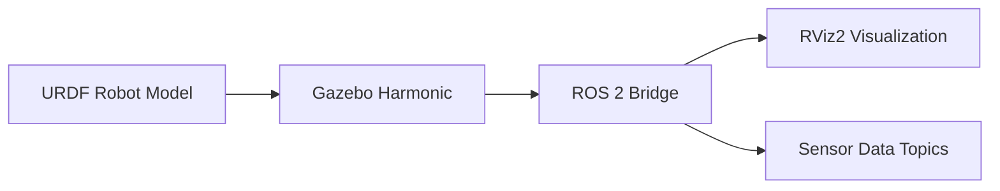

# Quickstart Guide: Chapter 3 - The Digital Twin – Gazebo & Unity

## Prerequisites

- ROS 2 Humble Hawksbill installed
- Gazebo Harmonic (Garden) installed
- Unity Hub and Unity Editor (2021.3 LTS or later)

## Installation Steps

### 1. Install Gazebo Harmonic with ROS 2 Bridge

```bash
sudo apt update
sudo apt install ros-humble-ros-gz ros-humble-ros-gz-sim
```

### 2. Verify Installation

```bash
gz --version
ros2 pkg list | grep gz
```

### 3. Create Workspace for Simulation

```bash
mkdir -p ~/gazebo_ros_ws/src
cd ~/gazebo_ros_ws
colcon build
source install/setup.bash
```

## Basic Simulation Pipeline

### URDF → Gazebo → ROS 2 Bridge → RViz



### Launch Example

```bash
# Launch Gazebo simulation
ros2 launch ros_gz_sim gz_sim.launch.py world_name:=empty.sdf

# Launch with robot model
ros2 launch ros_gz_sim spawn.launch.py robot_name:=my_robot sdf_file:=/path/to/robot.sdf
```

## Sensor Plugin Configuration

### Example LiDAR Plugin in URDF

```xml
<gazebo reference="lidar_link">
  <sensor type="ray" name="lidar_sensor">
    <pose>0 0 0 0 0 0</pose>
    <visualize>true</visualize>
    <update_rate>10</update_rate>
    <ray>
      <scan>
        <horizontal>
          <samples>360</samples>
          <resolution>1.0</resolution>
          <min_angle>-3.14159</min_angle>
          <max_angle>3.14159</max_angle>
        </horizontal>
      </scan>
      <range>
        <min>0.1</min>
        <max>30.0</max>
        <resolution>0.01</resolution>
      </range>
    </ray>
    <plugin filename="libgazebo_ros_laser.so" name="gazebo_ros_head_laser">
      <ros>
        <namespace>/robot</namespace>
        <remapping>scan:=/scan</remapping>
      </ros>
      <output_type>sensor_msgs/LaserScan</output_type>
    </plugin>
  </sensor>
</gazebo>
```

## Unity Integration Setup

1. Clone Unity Robotics Hub:
   ```bash
   git clone https://github.com/Unity-Technologies/Unity-Robotics-Hub.git
   ```

2. Import Unity ROS# package into Unity project

3. Configure TCP/IP bridge between Unity and ROS 2

## Next Steps

1. Follow Chapter 3 documentation for detailed setup
2. Complete the Gazebo setup tutorial (01-gazebo-setup.mdx)
3. Implement URDF/SDF humanoid model (02-urdf-sdf-humanoid.mdx)
4. Add sensor plugins (03-sensor-plugins.mdx)
5. Explore Unity integration (04-unity-intro.mdx)